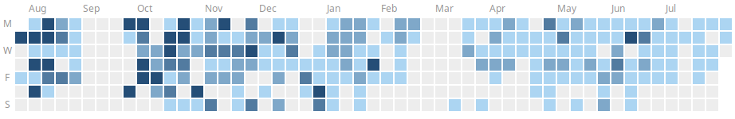

<p align="center">

[](https://github.com/cagix/test-pandoc-lecture/blob/_gfm/readme.md)

</p>


## Hello World

Hier ist normaler Markdown-Text, mit **fett** und auch *kursiv*.

-   Stichpunkt 1
-   Stichpunkt 2
-   Stichpunkt 3

1.  Aufzählung 1
2.  Aufzählung 2
3.  Aufzählung 3
    1.  Unterpunkt 3.1
    2.  Unterpunkt 3.2

Hier die ==Pandoc-Markdown== mark-Erweiterung.

## Math

### Inline

$\mathbf{g} = (g_1, \dots, g_m)\in \{ 0,1\}^m$

*    $a^ib^{2*i}$ ist nicht regulär
*    $a^ib^{2*i}$ für $0 \leq i \leq 3$ ist regulär

### Block

$$\Phi(\mathbf{g}_i) = F(\Gamma(\mathbf{g}_i)) - w\cdot\sum_j(Z_j(\Gamma(\mathbf{g}_i)))^2$$

$$p_{sel}(\mathbf{g}_k) = \frac{\Phi(\mathbf{g}_k)}{\sum_j \Phi(\mathbf{g}_j)}$$

$$
g_i^{(t+1)} = \left\{
\begin{array}{ll}
    \neg g_i^{(t)} & \mbox{ falls } \chi_i \le p_{mut}\\[5pt]
    \phantom{\neg} g_i^{(t)} & \mbox{ sonst }
\end{array}
\right.
$$

### Known Problems

*   VSCode Preview: `\mbox{ tanh }` => $\mbox{ tanh }$ => `\text{ tanh }` => $\text{ tanh }$
*   GH Preview:
    -   `\phantom{xyz}` => $\phantom{xyz}$ => ?? => ??
    -   `\operatorname{tanh}` => $\operatorname{tanh}$ => `\mathop{\text{tanh}}` => $\mathop{\text{tanh}}$

$$
g_i^{(t+1)} = \left\{
\begin{array}{rll}
    \neg & g_i^{(t)} & \mbox{ falls } \chi_i \le p_{mut}\\[5pt]
    & g_i^{(t)} & \mbox{ sonst }
\end{array}
\right.
$$

==Schwierig==: In Pandoc-Markdown muss Mathe mit `$` oder `$$` eingeschlossen werden, unabhängig vom konkreten Inhalt. In LaTeX ist aber `\begin{eqnarray}` bereits der Beginn einer Mathe-Umgebung, d.h. hier wären extra `$$` ==falsch==. Das muss per Filter korrigiert werden!

```
$$\begin{eqnarray}
S &\rightarrow& a A                      \nonumber \\
A &\rightarrow& d B \ | \ b A \ | \ c A  \nonumber \\
B &\rightarrow& a c \ | \ b C \ | \ c A  \nonumber \\
C &\rightarrow& \epsilon                 \nonumber
\end{eqnarray}$$
```

should become

$$\begin{eqnarray}
S &\rightarrow& a A                      \nonumber \\
A &\rightarrow& d B \ | \ b A \ | \ c A  \nonumber \\
B &\rightarrow& a c \ | \ b C \ | \ c A  \nonumber \\
C &\rightarrow& \epsilon                 \nonumber
\end{eqnarray}$$


## Links

### Link to WWW

[craftinginterpreters.com/the-lox-language.html](https://www.craftinginterpreters.com/the-lox-language.html)

### Internal Links

[selbe ebene: readme.md](readme.md)

[unterordner: subfolder/foo.md](subfolder/foo.md)

[zurück nach oben I: ../02-parsing/antlr-parsing.md](../02-parsing/antlr-parsing.md)

[zurück nach oben II: ../../homework/sheet01.md](../../homework/sheet01.md)


## Code

```antlr
grammar Hello;

start : stmt* ;

stmt  : ID '=' expr ';' | expr ';' ;
expr  : term ('+' term)* ;
term  : atom ('*' atom)* ;
atom  : ID | NUM ;

ID    : [a-z][a-zA-Z]* ;
NUM   : [0-9]+ ;
WS    : [ \t\n]+ -> skip ;
```

Java-Code kompilieren: `javac *.java`

``` {.java caption="The preprocessing step, cf. [@Dietz2018]" #lst:huh}
import org.antlr.v4.runtime.CharStreams;
import org.antlr.v4.runtime.CommonTokenStream;
import org.antlr.v4.runtime.tree.ParseTree;

public class Main {
    public static void main(String[] args) throws Exception {
        HelloLexer lexer = new HelloLexer(CharStreams.fromStream(System.in));
        CommonTokenStream tokens = new CommonTokenStream(lexer);
        HelloParser parser = new HelloParser(tokens);

        ParseTree tree = parser.start();  // Start-Regel
        System.out.println(tree.toStringTree(parser));
    }
}
```

Code ohne alles

```
import org.antlr.v4.runtime.CharStreams;
import org.antlr.v4.runtime.CommonTokenStream;
import org.antlr.v4.runtime.tree.ParseTree;

public class Main {
    public static void main(String[] args) throws Exception {
        HelloLexer lexer = new HelloLexer(CharStreams.fromStream(System.in));
        CommonTokenStream tokens = new CommonTokenStream(lexer);
        HelloParser parser = new HelloParser(tokens);

        ParseTree tree = parser.start();  // Start-Regel
        System.out.println(tree.toStringTree(parser));
    }
}
```


## Images


{width="20%"}



{width="20%"}


!["wuppie" via web (raw) (["FooFOOOO" by me on void.intern.com]{.origin})](https://raw.githubusercontent.com/cagix/pandoc-thesis/refs/heads/master/figs/wuppie.png)

["Foo" by me on void.extern.com]{.origin}

---

**Image w/o Caption**:

ohne alles:


mit breitenangabe:

{width="20%"}

mit breitenangabe und titel:

{width="20%"}


mit caption:


mit caption und breitenangabe:

{width="25%"}

mit caption und breitenangabe und titel:

{width="25%"}


### Known Problems

- In VSC preview as well as in LaTeX images via web like https://github.com/cagix/pandoc-thesis/blob/master/figs/wuppie.png do not work (**need to be "raw"**)


## Tabellen

| Rechtsbündig | Linksbündig | Default | Zentriert |
|-------------:|:------------|---------|:---------:|
|          foo | foo         | foo     |    foo    |
|          123 | 123         | 123     |    123    |
|          bar | bar         | bar     |    bar    |

: Tabelle als Markdown-Pipe-Table, vgl. [@SICP]

| Rechtsbündig | Linksbündig | Default | Zentriert |
|-------------:|:------------|---------|:---------:|
|          foo | foo         | foo     |    foo    |
|          123 | 123         | 123     |    123    |
|          bar | bar         | bar     |    bar    |

## Zitieren, Quellen

Normales Zitieren [@Siek2023racket] ...

Mit Seitenangabe [@Siek2023racket, Seite 111] oder Kapitel [@Siek2023racket, Kapitel 111] ...

Als Author-Zitat @Siek2023racket ...


## GFM

### Details

<details>

<summary>Zusammenfassung: NIX :)</summary>

Lalelu ...

</details>

### Alert Extension

GH introduced "alerts" with distinctive styling, like

> [!NOTE]
> Foo bar, wuppie fluppie!

> [!TIP]
> Foo bar, wuppie fluppie!

> [!IMPORTANT]
> Foo bar, wuppie fluppie!

> [!WARNING]
> Foo bar, wuppie fluppie!

> [!CAUTION]
> Foo bar, wuppie fluppie!

(see https://github.blog/changelog/2023-12-14-new-markdown-extension-alerts-provide-distinctive-styling-for-significant-content/)


Let's stick with Pandocs divs in Markdown content and use filters for export:

::: note
Foo bar, wuppie fluppie!
Blablabla
third line of nonsense ...
:::

::: tip
Foo bar, wuppie fluppie!
:::

::: important
Foo bar, wuppie fluppie!
:::

::: warning
Foo bar, wuppie fluppie!
:::

::: caution
Foo bar, wuppie fluppie!
:::

- Export to GH Markdown using ["distinctive alerts"](https://docs.github.com/en/get-started/writing-on-github/getting-started-with-writing-and-formatting-on-github/basic-writing-and-formatting-syntax#alerts)
- Export to Hugo using [notice shortcode](https://mcshelby.github.io/hugo-theme-relearn/shortcodes/notice/index.html)
- Export to Beamer using [beamercolorbox](https://tex.stackexchange.com/questions/411069/creating-beamer-box-environment) (also [beameruserguide.pdf](https://tug.ctan.org/macros/latex/contrib/beamer/doc/beameruserguide.pdf); or `block`, `alertblock`, `examples` - cf. https://www.overleaf.com/learn/latex/Beamer%23Creating_a_table_of_contents)

This should probably be in line with #180 ...


## Filter for Slides and Handouts

::: notes
Foo bar, wuppie fluppie! (NOTES)
:::

::: slides
THIS IS SLIDE-ONLY CONTENT, STUPID!
:::


## Footnotes

Sometimes[^1] we need some^[lalalala] footnotes.

[^1]: sometime even more often


## Handling of TeX Shenanigans

**Zustand:**

:   (Formale) Beschreibung eines Zustandes der Welt

**Aktion:**

:   (Formale) Beschreibung einer durch Agenten ausführbaren Aktion
    *   Anwendbar auf bestimmte Zustände
    *   Überführt Welt in neuen Zustand ("Nachfolge-Zustand")

LaTeX-Befehle wie `\bigskip` etc. sollten automatisch entfernt werden:

\bigskip
\bigskip

Hier nach den LaTeX-Befehlen.

**Geeignete Abstraktionen wählen für Zustände und Aktionen!**


## Credits

Typische Regeln und Konventionen tauchen überall auf, beispielsweise
bei Tim Pope (siehe nächstes Beispiel) oder bei
["How to Write a Git Commit Message"](https://cbea.ms/git-commit/).

```markdown
Short (50 chars or less) summary of changes

More detailed explanatory text, if necessary.  Wrap it to about
72 characters or so.  In some contexts, the first line is treated
as the subject of an email and the rest of the text as the body.
The blank line separating the summary from the body is critical
(unless you omit the body entirely); tools like rebase can get
confused if you run the two together.

Further paragraphs come after blank lines.

 - Bullet points are okay, too
 - Typically a hyphen or asterisk is used for the bullet, preceded
   by a single space, with blank lines in between, but conventions
   vary here
```

[["A Note About Git Commit Messages"](https://tbaggery.com/2008/04/19/a-note-about-git-commit-messages.html) by [Tim Pope](https://tpo.pe/) on tbaggery.com]{.origin}


## Filters

### ShowMe

Hier ein ShowMe-Test:

::: showme
this is hidden content ...
:::
(but not used anymore)

Use `details` instead:

::: details
this is hidden content ...
:::

::: {.details title="wuppie"}
this is a show-me w/ title :)
:::

### CBOX

::: cbox
this is content to be centered (and put into a box)...
:::
(but not used anymore)

### Center

::: center
this content should be centered
:::

### Alert

This [will]{.alert} be highlighted.
(but not used anymore)

Use [Pandoc's mark extension](https://pandoc.org/MANUAL.html#extension-mark) instead: This ==will== be highlighted. Even ==**with bold**== text.


### Hinweis

[This is a hint.]{.hinweis}
(but not used anymore)


### Thema

[The topic of this task or ...]{.thema}
(but not used anymore)


### BSP

Lalalelu

[Simple Beispiel-Button X]{.bsp}
(but not used anymore)

lalelu

use `ex` instead:

[Simple Beispiel-Button X]{.ex}

[Beispiel-Button w/ link]{.ex href="https://github.com/sdiehl/write-you-a-haskell/blob/master/README.md"}


Vor `\pause`...

\pause

Nach `\pause`...
