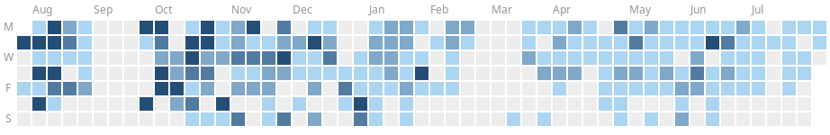

# Test Markdown


## TL;DR

<details>

Text für TL;DR …

</details>


## Videos (YouTube)

<details>

- [VL Parser mit ANTLR](https://youtu.be/YuUHBvPUS4k)
- [Demo ANTLR Parser](https://youtu.be/FJOEPY-TMmw)

</details>


## Videos (HSBI-Medienportal)

<details>

- [VL Git
Basics](https://www.hsbi.de/medienportal/m/3a44c8a32e7699db77ae922c6b8944acf0d8c65b78d02859e707ffdf783ea45a78200312cdb8102c1052f382101b69a5092bcaf0a11ded36b98f4552a4aca345)

</details>


## Materialien

<details>

- [NN03-Logistische_Regression.pdf](https://raw.githubusercontent.com/Artificial-Intelligence-HSBI-TDU/KI-Vorlesung/master/lecture/nn/files/NN03-Logistische_Regression.pdf)

</details>


## Lernziele

<details>

- K1: K1

- K2: K2

- K3: K3.1
- K3: K3.2

</details>


## Hello World

Hier ist normaler Markdown-Text, mit **fett** und auch *kursiv*.

- Stichpunkt 1
- Stichpunkt 2
- Stichpunkt 3

1.  Aufzählung 1
2.  Aufzählung 2
3.  Aufzählung 3
    1.  Unterpunkt 3.1
    2.  Unterpunkt 3.2

## Math

### Inline

$`\mathbf{g} = (g_1, \dots, g_m)\in \{ 0,1\}^m`$

- $`a^ib^{2*i}`$ ist nicht regulär
- $`a^ib^{2*i}`$ für $`0 \leq i \leq 3`$ ist regulär

### Block

``` math
\Phi(\mathbf{g}_i) = F(\Gamma(\mathbf{g}_i)) - w\cdot\sum_j(Z_j(\Gamma(\mathbf{g}_i)))^2
```

``` math
p_{sel}(\mathbf{g}_k) = \frac{\Phi(\mathbf{g}_k)}{\sum_j \Phi(\mathbf{g}_j)}
```

``` math

g_i^{(t+1)} = \left\{
\begin{array}{ll}
    \neg g_i^{(t)} & \mbox{ falls } \chi_i \le p_{mut}\\[5pt]
    \phantom{\neg} g_i^{(t)} & \mbox{ sonst }
\end{array}
\right.
```

## Links

### Link to WWW

[craftinginterpreters.com/the-lox-language.html](https://www.craftinginterpreters.com/the-lox-language.html)

### Internal Links

[selbe ebene: readme.md](readme.md)

[unterordner: subfolder/foo.md](subfolder/foo.md)

[zurück nach oben I:
../02-parsing/antlr-parsing.md](../02-parsing/antlr-parsing.md)

[zurück nach oben II:
../../homework/sheet01.md](../../homework/sheet01.md)

## Code

``` antlr
grammar Hello;

start : stmt* ;

stmt  : ID '=' expr ';' | expr ';' ;
expr  : term ('+' term)* ;
term  : atom ('*' atom)* ;
atom  : ID | NUM ;

ID    : [a-z][a-zA-Z]* ;
NUM   : [0-9]+ ;
WS    : [ \t\n]+ -> skip ;
```

Java-Code kompilieren: `javac *.java`

## Images

<figure>

<figcaption aria-hidden="true">“B” (small)</figcaption>
</figure>

<figure>

<figcaption aria-hidden="true">“B”, width=“20%”</figcaption>
</figure>

<figure>

<figcaption aria-hidden="true">“wuppie” (wide)</figcaption>
</figure>

<figure>

<figcaption aria-hidden="true">“wuppie”, width=“20%”</figcaption>
</figure>

<figure>

<figcaption aria-hidden="true">“wuppie” via web</figcaption>
</figure>

## Tabellen

| Rechtsbündig | Linksbündig | Default | Zentriert |
|-------------:|:------------|---------|:---------:|
|          foo | foo         | foo     |    foo    |
|          123 | 123         | 123     |    123    |
|          bar | bar         | bar     |    bar    |

Tabelle als Markdown-Pipe-Table, vgl. ([Abelson, Sussmann, und Sussmann
1996](#ref-SICP))

## Zitieren, Quellen

Normales Zitieren ([Siek 2023](#ref-Siek2023racket)) …

Mit Seitenangabe ([Siek 2023, 111](#ref-Siek2023racket)) oder Kapitel
([Siek 2023, Kap. 111](#ref-Siek2023racket)) …

Als Author-Zitat Siek ([2023](#ref-Siek2023racket)) …

## GFM

### Details

<details>

<summary>

Zusammenfassung: NIX :)
</summary>

Lalelu …

</details>

### Alert Extension

GH introduced “alerts” with distinctive styling, like

> \[!NOTE\] Foo bar, wuppie fluppie!

> \[!TIP\] Foo bar, wuppie fluppie!

> \[!IMPORTANT\] Foo bar, wuppie fluppie!

> \[!WARNING\] Foo bar, wuppie fluppie!

> \[!CAUTION\] Foo bar, wuppie fluppie!

(see
https://github.blog/changelog/2023-12-14-new-markdown-extension-alerts-provide-distinctive-styling-for-significant-content/)

Let’s stick with Pandocs divs in Markdown content and use filters for
export:

> [!NOTE]
>
> Foo bar, wuppie fluppie! Blablabla third line of nonsense …

- Export to GH Markdown using [“distinctive
  alerts”](https://docs.github.com/en/get-started/writing-on-github/getting-started-with-writing-and-formatting-on-github/basic-writing-and-formatting-syntax#alerts)
- Export to Hugo using [notice
  shortcode](https://mcshelby.github.io/hugo-theme-relearn/shortcodes/notice/index.html)
- Export to Beamer using
  [beamercolorbox](https://tex.stackexchange.com/questions/411069/creating-beamer-box-environment)
  (also
  [beameruserguide.pdf](https://tug.ctan.org/macros/latex/contrib/beamer/doc/beameruserguide.pdf);
  or `block`, `alertblock`, `examples` -
  cf. https://www.overleaf.com/learn/latex/Beamer%23Creating_a_table_of_contents)

This should probably be in line with \#180 …

## Filter for Slides and Handouts

Foo bar, wuppie fluppie! (NOTES)

## Footnotes

Sometimes[^1] we need some[^2] footnotes.

## Handling of TeX Shenanigans

**Zustand:**  
(Formale) Beschreibung eines Zustandes der Welt

**Aktion:**  
(Formale) Beschreibung einer durch Agenten ausführbaren Aktion

- Anwendbar auf bestimmte Zustände
- Überführt Welt in neuen Zustand (“Nachfolge-Zustand”)

LaTeX-Befehle wie `\bigskip` etc. sollten automatisch entfernt werden:

Hier nach den LaTeX-Befehlen.

<span class="alert">**Geeignete Abstraktionen wählen für Zustände und
Aktionen!**</span>

## Credits

Typische Regeln und Konventionen tauchen überall auf, beispielsweise bei
Tim Pope (siehe nächstes Beispiel) oder bei [“How to Write a Git Commit
Message”](https://cbea.ms/git-commit/).

``` markdown
Short (50 chars or less) summary of changes

More detailed explanatory text, if necessary.  Wrap it to about
72 characters or so.  In some contexts, the first line is treated
as the subject of an email and the rest of the text as the body.
The blank line separating the summary from the body is critical
(unless you omit the body entirely); tools like rebase can get
confused if you run the two together.

Further paragraphs come after blank lines.

 - Bullet points are okay, too
 - Typically a hyphen or asterisk is used for the bullet, preceded
   by a single space, with blank lines in between, but conventions
   vary here
```

<span class="origin">Quelle: [“A Note About Git Commit
Messages”](https://tbaggery.com/2008/04/19/a-note-about-git-commit-messages.html)
by [Tim Pope](https://tpo.pe/) on tbaggery.com</span>

------------------------------------------------------------------------

# Literatur

<div id="refs" class="references csl-bib-body hanging-indent"
entry-spacing="0">

<div id="ref-SICP" class="csl-entry">

Abelson, H., G. J. Sussmann, und J. Sussmann. 1996. *Structure and
Interpretation of Computer Programs*. MIT Press.
<https://mitpress.mit.edu/sites/default/files/sicp/index.html>.

</div>

<div id="ref-Nystrom2021" class="csl-entry">

Nystrom, R. 2021. *Crafting Interpreters*. Genever Benning.
<https://github.com/munificent/craftinginterpreters>.

</div>

<div id="ref-Siek2023racket" class="csl-entry">

Siek, J. G. 2023. *Essentials of Compilation: An Incremental Approach in
Racket*. The MIT Press.
<https://github.com/IUCompilerCourse/Essentials-of-Compilation>.

</div>

<div id="ref-Tate2011" class="csl-entry">

Tate, B. A. 2010. *Seven Languages in Seven Weeks*. Pragmatic Bookshelf.
<https://learning.oreilly.com/library/view/seven-languages-in/9781680500059/>.

</div>

</div>

------------------------------------------------------------------------

[^1]: sometime even more often

[^2]: lalalala


## Quizzes

<details>

- [Quiz Git Basics
(ILIAS)](https://www.hsbi.de/elearning/goto.php?target=tst_1106241&client_id=FH-Bielefeld)

</details>


## Challenges

<details>

**Lexer und Parser mit ANTLR: Programmiersprache Lox**

Betrachten Sie folgenden Code-Schnipsel in der Sprache
[“Lox”](https://www.craftinginterpreters.com/the-lox-language.html):

    fun fib(x) {
        if (x == 0) {
            return 0;
        } else {
            if (x == 1) {
                return 1;
            } else {
                fib(x - 1) + fib(x - 2);
            }
        }
    }

    var wuppie = fib(4);

Erstellen Sie für diese fiktive Sprache einen Lexer+Parser mit ANTLR.
Implementieren Sie mit Hilfe des Parse-Trees und der Listener oder
Visitoren einen einfachen Pretty-Printer.

(Die genauere Sprachdefinition finden Sie bei Bedarf unter
[craftinginterpreters.com/the-lox-language.html](https://www.craftinginterpreters.com/the-lox-language.html).)

</details>


---

## Zum Nachlesen

- Tate ([2010, Kap. 2](#ref-Tate2011))
- Nystrom ([2021](#ref-Nystrom2021))


## Quellen

<div id="refs" class="references csl-bib-body hanging-indent"
entry-spacing="0">

<div id="ref-SICP" class="csl-entry">

Abelson, H., G. J. Sussmann, und J. Sussmann. 1996. *Structure and
Interpretation of Computer Programs*. MIT Press.
<https://mitpress.mit.edu/sites/default/files/sicp/index.html>.

</div>

<div id="ref-Nystrom2021" class="csl-entry">

Nystrom, R. 2021. *Crafting Interpreters*. Genever Benning.
<https://github.com/munificent/craftinginterpreters>.

</div>

<div id="ref-Siek2023racket" class="csl-entry">

Siek, J. G. 2023. *Essentials of Compilation: An Incremental Approach in
Racket*. The MIT Press.
<https://github.com/IUCompilerCourse/Essentials-of-Compilation>.

</div>

<div id="ref-Tate2011" class="csl-entry">

Tate, B. A. 2010. *Seven Languages in Seven Weeks*. Pragmatic Bookshelf.
<https://learning.oreilly.com/library/view/seven-languages-in/9781680500059/>.

</div>

</div>

---

FOOO

## LICENSE


Unless otherwise noted, this work is licensed under CC BY-SA 4.0.
